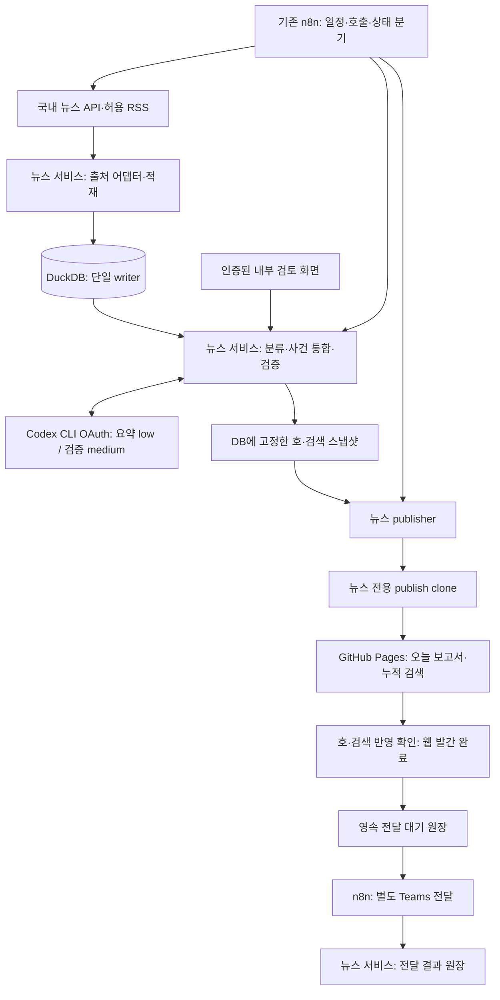

# 일간 풍력 뉴스 브리핑 실행계획 — 구축된 n8n 활용

- 작성·확인 기준일: 2026-09-30
- 계획 버전: v1.1 — 사용자 지정 저장소·뉴스 DB 지속 축적·웹 우선 조회 반영
- 상태: 공개 기사 수집기·뉴스 DB·웹 배포·n8n 연결과 운영 일정 5개 활성화를 완료했다. OAuth 요약(low)·독립 검증(medium)을 거쳐 2026-09-30 보고서 7건을 게시했고, 2026-10-01 08:00 정기 게시에서 3건 발간·1건 보류를 확인했다. Teams는 미연결이다. 최신 검증 근거는 [구현·운영 안내](wind-news-operations.md)를 따른다.
- 기준 요구사항: [PRD-daily-wind-briefing.md](PRD-daily-wind-briefing.md)
- 기존 설치 참고자료: [n8n-windows-setup-guide.md](n8n-windows-setup-guide.md)
- 운영 대상: 서버 PC `desktop-evu6usl`의 기존 n8n
- 관리 화면: <https://desktop-evu6usl.tailab9675.ts.net:8444/home/workflows>
- GitHub 저장소(사용자 확정): <https://github.com/jung372/BRE-Workflow-Automation2>
- 웹 기준 주소: <https://jung372.github.io/BRE-Workflow-Automation2/> — GitHub Pages 운영 배포 완료
- 아침 확인용 고정 주소: <https://jung372.github.io/BRE-Workflow-Automation2/#/daily>

## 1. 실행 방향

### 2026-09-30 후속 사용자 확정: 공개 기사 직접 수집

별도 언론사 계약·공급사 비용 확인을 선행 조건에서 제외하고 연합뉴스·전기신문·에너지신문의 공개 페이지를 수집한다. 외부 유료/무료 식별값은 요구하지 않으며, 실제 공개 본문 접근을 확인한다. 로그인·결제 필요 기사는 제외하고 출처·원문 링크를 표시한다. 이전의 공급원 계약 확인 대기 계획보다 이 변경을 우선한다. 상세 운영 방침은 [수집 서비스 검토](wind-news-source-review.md)의 최신 사용자 결정에 기록했다.

### 2026-09-30 수집원 정정

네이버 검색 API의 현행 특약 2.3·2.4는 AI 입력 및 영구 DB 축적과 맞지 않으므로 아래 네이버 발견원·키 발급 계획은 폐기한다. 실제 호출도 코드에서 차단한다. 무료 대체 후보인 정책브리핑은 RSS가 2026-07-01 종료되어 기존 RSS 주소를 사용하지 않는다. 자료별 공공누리 제1유형 표시와 텍스트 이용조건을 확인하는 별도 수집 경로가 필요하며 일반 언론 기사 수집을 대체했다고 간주하지 않는다. 저장·요약·게시 권한 및 실제 수집 검증 전까지 발간 일정은 비활성이다.

근거: [네이버 약관](https://developers.naver.com/products/terms/), [정책브리핑 RSS 종료](https://www.korea.kr/etc/noticeView.do?newsId=132038885), [정책브리핑 저작권정책](https://www.korea.kr/guide/copyRight.do).

### 2026-09-30 최종 구현 변경: OAuth 자동 요약·검증

사용자 최종 지시로 매일 수동 검토하는 방식은 Codex CLI의 OpenAI/ChatGPT OAuth 자동 처리로 변경한다. Python 서비스가 비공개 서버의 전용 로그인 디렉터리를 사용하는 `codex exec`를 호출하고 CLI가 토큰을 갱신한다. 요약은 `gpt-6.1-sol`의 `low`, 독립 근거 검증은 같은 모델의 `medium`을 기본값으로 둔다. 근거 검사를 통과한 항목만 자동 승인·발간하며 인증·사용량·근거 검증 실패는 보류한다. 별도 Platform API 키로 자동 전환하지 않는다.

이 변경은 아래 최초 설계의 일일 수동 승인·API 키 기반 LLM 연결 부분보다 우선한다. 초기 품질 지표와 서버 무인 복구 검증은 운영 점검 항목으로 유지한다. 실제 인증 연결·호출 한도·Docker 및 n8n 설치 절차는 [구현·운영 안내](wind-news-operations.md)를 따른다.

**이미 구축된 n8n에 뉴스 업무용 워크플로를 추가하고, Python 뉴스 처리 서비스와 연결해 매일 아침 웹 보고서와 Teams 요약을 발간한다.** n8n 신규 설치부터 시작하던 기존 계획을 환경 점검 → 샘플 보고서 → 수집·편집 자동화 → 웹·Teams 연결 → 7일 비공개 검증 순서로 바꾼다.

보고서 전문은 기존 GitHub Pages의 `일간 시황` 메뉴에서 읽고, Teams에는 핵심 5건과 날짜별 보고서 링크를 제공한다. PDF·Word 첨부나 이메일 발송은 이번 기본 산출물에 포함하지 않는다. 별도 파일 보고서가 필요하면 검증된 동일 호 데이터를 이용하는 후속 출력 기능으로 추가한다.

**일간으로 정리한 뉴스와 발간 이력을 DB에 계속 축적하고, 사용자는 Teams 알림 없이도 매일 아침 같은 웹 주소에서 오늘 보고서와 누적 기사를 조회한다.** 웹은 주 이용 채널, Teams는 보조 알림 채널이다. DB 저장 → 웹 게시·검색 반영 확인으로 발간을 완료하며, Teams의 전송 실패·연결 미설정은 웹 발간을 막지 않는다.

기존 PRD의 국내 기사 범위, 사건별 대표기사 1건, 계약 단계 구분, 검토·정정, 기존 정적 JSON 계약은 유지하고 누적 검색 계약을 추가한다. 이 문서는 구축 상태를 반영한 실행 순서와 책임 경계를 구체화한다. 이번 사용자 요청에 따른 보존 정책·검색 범위·웹과 Teams의 성공 기준은 원본 PRD에도 반영한다.

| 기존 계획 | 이번 실행계획 |
|---|---|
| Windows에 WSL·Docker·n8n 신규 구축 | 현재 설치된 n8n 재사용. 설치 방식·버전·영속성·복구 상태부터 확인 |
| n8n DB를 PostgreSQL로 새 구성 | 현재 DB를 우선 유지. DB 전환은 성능·복구 검증 결과에 따라 별도 결정 |
| n8n·PostgreSQL·뉴스 서비스를 한 번에 구성 | 뉴스 처리 서비스만 추가하고 기존 n8n과 내부 HTTP로 연결 |
| UI와 전체 파이프라인을 단계별 개발 | 샘플 1개 호를 먼저 완성해 출력 형식을 확인한 뒤 자동화 연결 |
| 서버 설치 중심의 M3 | 기존 인스턴스에 워크플로 import·credential 연결·게시와 전달 검증 |
| 과거 호 조회 중심 | 오늘 보고서·날짜별 보고서·누적 기사 검색을 1차 구현에 포함 |
| 정규화 데이터·사건·호 2년 보존 제안 | 발간 기사 메타데이터·자체 요약·호·정정 이력은 자동 만료 없이 지속 보관 |
| 웹·Teams를 묶은 발간 지표 | 웹 게시 완료와 Teams 전달을 별도 관리·측정 |

## 2. 확인한 사실과 남은 확인

아래 표는 최초 계획 수립 시점의 기록이다. 이후 서버 설치·Pages 배포·n8n 연결·OAuth 실제 2단계 호출은 완료했으며, 현재 상태는 위 요약과 운영 안내의 최신 검증 기록을 따른다.

| 항목 | 2026-09-30 확인 결과 | 계획에 미치는 영향 |
|---|---|---|
| n8n 관리 URL | 브라우저에서 `Workflows - n8n` 화면 접근 성공 | 해당 인스턴스를 연계 대상으로 사용 |
| 현재 보이는 워크플로 화면 | `Let's build your first automation` 안내 표시 | 현재 계정 화면에서 기존 뉴스 워크플로를 확인하지 못함. 인스턴스 전체가 비어 있다고 단정하지 않음 |
| n8n 설치 방식·버전·DB | 미확인 | Docker/WSL/npm, SQLite/PostgreSQL 여부를 추측해 재설치하지 않음 |
| 서버 재기동·무인 실행·백업 | 미확인 | 화면 접속 성공과 24시간 운영 가능 여부를 별도로 검증 |
| 기존 웹 | 로컬 `assets/app.js`가 `data/status.json` 사용 | 공지 렌더러를 보존하고 뉴스 렌더러 추가 |
| 기존 publisher | `push_to_github.py`의 게시 대상은 공지 JSON 두 개 | 뉴스 전용 publisher·publish clone 필요 |
| 코드 배포 CI | `ci-deploy.yml`에 `data/wind-news/**` 제외 규칙 없음 | 뉴스 일간 게시가 Windows 코드 재배포를 유발하지 않도록 구현 단계에서 보완 |
| 서버 역할·경로 | README에 서버 PC와 개발 PC가 구분됨 | 현재 개발 작업공간의 OS·프로세스 상태를 서버 현황으로 쓰지 않음 |
| 뉴스 API·LLM·Teams·Pages 설정 | 실제 인증·전송·게시 미검증 | 아래 준비 단계에서 연결 및 정책 확인 |

n8n 공식 문서는 SQLite 기본 사용과 PostgreSQL 지원을 안내한다. 따라서 기존 PRD의 PostgreSQL 제안을 이미 설치된 인스턴스의 필수 재구축 조건으로 적용하지 않는다. 현재 DB를 유지할 수 있는지는 일관된 백업·복원과 예상 실행량 검증으로 결정한다. [n8n Database](https://docs.n8n.io/deploy/host-n8n/configure-n8n/basic-configuration/use-environment-variables/database)

## 3. 매일 발간할 보고서

| 항목 | 기본안 |
|---|---|
| 독자 | 국내 풍력 개발·사업관리·EPC·금융 실무자 |
| 제목 | `풍력 일간 시황 · YYYY-MM-DD` |
| 주기 | 주말·공휴일 포함 매일, 08:00 발행 시도·08:15까지 웹 보고서와 누적 검색 반영 목표. Teams 요청 접수는 별도 지표 |
| 일반 집계 구간 | 전일 07:30 이상 ~ 당일 07:30 미만, KST |
| 기사 범위 | 국내 매체의 한국어 기사, 국내 풍력 및 국내 기업 관련 사업 |
| 핵심 주제 | 육상·해상풍력, EPC, 금융·PF, 터빈·공급망, 인허가·정책, 사고, 민원, MOU, 착공·준공 등 |
| 선정량 | 사건별 대표기사 1건, 최대 15건. 최소 건수 강제 없음 |
| 웹 | 오늘의 핵심 최대 3줄, 기사별 2~3문장 요약·분류·출처·기사시각·원문 링크, 날짜별 과거 호, 전체 발간 이력 검색 |
| DB 축적 | 매일 선정·발간한 기사, 자체 요약, 사건, 날짜별 호, 정정 이력을 지속 저장 |
| Teams | 상위 최대 5건·총 주제 수·마감시각·수집 상태·날짜별 보고서 링크 |
| 초기 검토 | 7일 비공개 초안 검토. 주요 사고·분쟁·민원과 불확실 기사는 이후에도 검토 대상 |

웹 메뉴는 PRD대로 `1. 공지 모니터링 대시보드`, `2. 일간 시황`으로 구성한다. 주소는 `#/notices`, `#/daily`, `#/daily/YYYY-MM-DD`를 사용하며 기존 프로젝트 경로와 상대경로 자산 로딩을 유지한다.

### 아침 확인과 누적 검색

- `#/daily`를 즐겨찾기용 고정 주소로 제공한다. 접속할 때 최신 manifest를 재검증하여 오늘 호 유무·보고서 날짜·집계 마감·웹 반영시각을 표시한다. 오래 열어 둔 화면도 다시 활성화되거나 `새로고침`을 누르면 최신 호를 확인한다.
- `일간 시황` 안에 `오늘 브리핑 / 날짜별 보기 / 누적 기사 검색`을 둔다. 기존 기본 진입 화면인 공지 대시보드에는 최신 브리핑 날짜·상태와 바로가기 링크를 추가한다.
- 누적 기사 검색 주소는 `#/daily/archive`로 제안한다. 날짜 범위(기본: 브리핑 발행일), 제목·자체 요약 키워드, 기업, 프로젝트, 지역, 육상/해상, 사건 분류 필터와 최신순·과거순 정렬을 제공한다.
- 초기 범위는 최근 30일로 명시하고 `전체 기간`을 선택하면 모든 발간 이력을 검색한다. 날짜별 보기·검색 조건은 URL에 보존하여 즐겨찾기와 새로고침 때 유지한다.
- 결과에는 브리핑 날짜·기사시각·제목·요약·분류·출처·원문 링크·해당 호 링크를 표시한다. 호 내 기사 위치로 이동하며 정정이 있으면 최신 유효 revision을 기본으로 보여준다.
- 검색은 공개 승인된 발간 기사 전체를 대상으로 한다. 미선정 후보·보류 기사·기사 전문은 공개 검색에 포함하지 않는다. 하루 최대 15건은 해당 호 선정 상한이며 누적 보관 건수 상한이 아니다.
- 오늘 호가 아직 없으면 이전 호 날짜와 `오늘 브리핑 준비 중`을 표시하고, 08:15 이후에는 `오늘 브리핑 발행 지연`으로 바꾼다. 검색 결과 0건과 검색 파일 로딩 실패를 구분한다.

### 지속 축적과 웹 조회 방식

서버의 DuckDB를 뉴스 이력의 기준 저장소로 사용한다. GitHub Pages에는 검증된 DB 스냅샷에서 생성한 공개 보고서 JSON과 검색용 JSON을 게시한다. 사용자는 웹에서 DB에 축적된 발간 이력을 검색하지만, 브라우저가 서버 DB나 사설 n8n에 직접 연결할 필요는 없다. 이미 게시된 보고서·검색 자료는 서버 PC 또는 Teams가 중단되어도 Pages가 제공 가능한 동안 계속 조회할 수 있다. 새 호 생성은 서버 복구가 필요하다.

| 저장 대상 | 내용과 보존 정책 |
|---|---|
| 기사·사건 | 안정적인 `article_id`, `event_id`, 출처·원문 URL·기사시각·분류·기업·프로젝트·지역·중복 관계 |
| 발간 호·항목 | `issue_id`, 발행일·revision·cutoff·고정 대표기사·자체 요약·근거 메타데이터·내용 해시 |
| 정정·게시 | 이전 revision, 정정 사유·시각, 공개 경로·commit·웹 확인 기록 |
| 장기 보존 | 발간 기사 메타데이터·자체 요약·관련 사건·호·정정 이력은 자동 만료 없이 지속 보관. 기존 2년 삭제 제안은 이 범위에 적용하지 않음 |
| 제한 보존 | 미발간 후보 메타데이터는 2년, 허용 원천 텍스트 최대 30일, 마스킹한 운영 로그 30일을 초기안으로 유지. 출처별 더 짧은 이용 조건 우선 |

발간 데이터에 참조된 기사·사건·근거 메타데이터는 후보 정리 작업에서 삭제하지 않는다. 원문 전문을 영구 저장한다는 의미는 아니며, 정정·권리상 조치가 필요하면 이력을 추적해 처리한다. 동일 기사 재수집은 중복 행을 추가하지 않고, 호별 발간 내용은 스냅샷으로 고정한다. DB와 원천 manifest를 백업하고 DB에서 전체 공개 보고서·검색 인덱스를 재생성할 수 있어야 한다.

누적 검색은 월별로 분할한 인덱스를 필요한 범위만 읽는 방식으로 시작한다. 검색 manifest에 대상 월·건수·파일 경로·해시·스냅샷 버전을 기록한다. 전체 기간 검색은 해당 월들을 모두 확인하고 진행률·완료 범위를 표시한다. 일부 월의 조회가 실패하면 불완전한 검색임을 알리고 재시도를 제공한다. DB 파일 전체를 웹에 내려주거나 매일 전체 기사 데이터를 다시 받는 구조는 사용하지 않는다.

월별 검색 항목에는 `issue_id`, `issue_date`, `revision`, `event_id`, `representative_article_id`, 제목·자체 요약·분류·기업·프로젝트·지역·출처·기사시각과 호 경로를 둔다. 같은 호의 정정 revision은 최신 유효 항목만 검색하고, 신규 사실이 있는 후속 사건은 별도 결과로 남긴다. 기업·프로젝트 검색은 1차 범위이며 시계열 분석·통계 보고서는 후속 범위다.

보고서 한 건의 구성은 다음과 같다. 아래는 실제 기사 없는 출력 틀이다.

```text
풍력 일간 시황 · YYYY-MM-DD
집계: 전일 07:30 ~ 당일 07:30 KST | 발행시각 | 정상/일부 출처 지연

오늘의 핵심
• 선정 기사에서 확인한 주요 변화 최대 3개

01 [해상풍력][EPC·시공] 대표기사 제목
핵심 사실: 원문에 근거한 2~3문장
사업·기업·지역: 확인된 값만 표시
금액·용량·계약 단계: 원문 근거가 있는 값만 표시
사업상 확인할 점: 필요한 경우 사실 요약과 구분
출처: 매체 / 기사시각 / 대표기사 원문 링크

수집·편집 상태
적합 기사 수 / 중복 통합 수 / 게시 사건 수 / 검토 보류 수
수집 지연·제목/검색 요약만 사용한 항목·정정 이력
```

## 4. 구성과 책임 경계



| 구성 | 담당 업무 | 저장·실행 원칙 |
|---|---|---|
| 기존 n8n | 정시 실행, API/RSS 요청, 서비스 호출, 작업 조회, 발행·전달 흐름 | 기존 내부 DB 유지, 뉴스용 workflow 이름·태그 구분 |
| Python `news-service` | 출처별 정규화, 풍력 적합도, 사건 중복 통합, 대표기사, LLM 호출·검증, 편집, 게시·전달 원장 | 일반 HTTP API, 기존 scraper와 독립된 의존성 환경 |
| DuckDB + Polars | 발간 뉴스 지속 축적, 기사·사건·호·정정 이력, 정제·품질검사 | 서비스 한 프로세스의 writer 큐로 직렬화, 공개 자료 재생성의 기준 |
| 내부 검토 화면 | 승인·보류·제외, 대표기사 교체, 사건 분리·병합, 정정 | 운영자 인증, 승인 대상 내용 해시 고정 |
| 뉴스 publisher | DB 스냅샷에서 호·검색 JSON 생성·Git commit/push·Pages 검증 | 코드 release·publish clone·runtime 분리 |
| GitHub Pages | 오늘 보고서·과거 호·전체 발간 기사 검색/필터 | 공개 JSON만 조회, Teams·사설 DB 연결에 의존하지 않음 |
| Teams Workflows | 채널에 요약 카드 게시 | 뉴스용 연결, 별도 전달 키·결과 증거 |

수집 HTTP 요청의 일정·페이지 반복은 n8n에서 조율하되, 응답 해석·스키마 변경 대응은 출처별 Python 어댑터에 둔다. HTML 본문 수집이 필요한 출처는 서비스의 동일 출처 어댑터를 호출한다. 기사 처리 규칙을 n8n Code 노드와 Python 양쪽에 중복 구현하지 않는다.

기존 n8n이 컨테이너라면 같은 내부 네트워크에 뉴스 서비스를 추가하는 방안을 우선 검토한다. 다른 설치 방식이면 그 실행 환경에서 도달 가능한 인증된 내부 서비스 주소를 선택한다. 컨테이너의 `localhost`가 Windows 호스트를 뜻한다고 가정하지 않는다. `/home/workflows`는 관리 화면 주소이며 뉴스 처리 API 주소로 사용하지 않는다.

n8n 관리 화면과 검토 화면은 운영자 접근용으로 유지한다. GitHub Pages에서 사설 n8n 주소로 직접 요청하지 않는다. 이 흐름은 n8n에서 Teams로 보내는 방식이므로 Teams가 사설 n8n에 접속하는 공개 callback을 기본으로 요구하지 않는다.

## 5. n8n 워크플로 구성

기존 PRD의 WF-01~06 역할은 유지한다. 오류 이벤트와 주기 감시는 테스트·운영 방식이 달라 WF-05를 두 워크플로로 나눈다. 아래 이름·API는 새로 구현할 계약이며 현재 서버에 존재하는 기능이 아니다.

| ID / 이름 | 시작 조건·KST | 주요 노드와 처리 | 종료 조건 |
|---|---|---|---|
| WF-01 `BRE-WIND-01-Collect` | 매시 05분 + 07:30 마감 | Schedule Trigger → 설정 조회 → Loop Over Items → HTTP Request/RSS → 출처별 결과 ingest → Wait/작업 조회 | 출처별 성공·0건·오류·포화, batch ID 기록 |
| WF-02 `BRE-WIND-02-Prepare` | 07:40 | Schedule Trigger → 마감 수집 완료 조회 → IF → 초안 준비 요청 → Wait/조회 → 품질 분기 → 호·기사 스냅샷 DB 저장 | READY / REVIEW_REQUIRED / BLOCKED |
| WF-03 `BRE-WIND-03-Publish` | 08:00, 이후 복구 흐름 | Schedule Trigger → 승인·품질·호 락 → DB 스냅샷에서 호·검색 게시 → Pages 검증 → 웹 완료 기록·전달 대기 생성 | WEB_VERIFIED, Teams 결과와 독립 |
| WF-04 `BRE-WIND-04-Deliver` | 웹 완료 뒤 별도 호출, 미처리 대기는 WF-05B가 재개 | Execute Sub-workflow Trigger → 전달 claim → IF → Teams HTTP Request → 응답 원장 기록 | ACCEPTED / DELIVERED / FAILED / UNKNOWN |
| WF-05A `BRE-WIND-05A-Errors` | 연결된 workflow의 Error Trigger | 오류 정제 → 실패 원장 → 조치 분기 → 운영자 알림 | 비밀값 없는 오류 코드·다음 조치 기록 |
| WF-05B `BRE-WIND-05B-Reconcile` | 5분마다 | Schedule Trigger → 누락 일정·멈춘 작업·미완료 호 조회 → 허용 단계 재개 | 같은 job·호·전달 키 재사용 |
| WF-06 `BRE-WIND-06-Backup` | 매일 02:30 제안 | Schedule Trigger → 보호된 백업 작업 요청 → 결과 조회 → 실패 처리 | 일관된 DB·설정·workflow·키 백업 확인 |

설정할 cron 예시는 `5 * * * *`, `30 7 * * *`, `40 7 * * *`, `0 8 * * *`, `*/5 * * * *`, `30 2 * * *`다. 뉴스 workflow마다 `Asia/Seoul`을 명시한다. Schedule Trigger는 저장 후 게시되어야 자동 실행하며, 설치 버전의 UI·동작을 확인한다. 최신 문서의 누락 일정 복구 기능은 버전·scheduler 조건이 있으므로 WF-05B의 호 원장 대조를 기본 복구 수단으로 유지한다. [n8n Schedule Trigger](https://docs.n8n.io/integrations/builtin/core-nodes/n8n-nodes-base.scheduletrigger/)

Error Trigger는 각 업무 workflow의 Error workflow 설정에 연결한다. 수동 실행 오류만으로 작동 여부를 판정할 수 없으므로, 구현 검증 때 외부 발송 없는 시험 workflow의 자동 실행 실패로 확인한다. 노드가 오류를 처리하고 계속 진행한 경우도 서비스의 실패 원장에 남겨 WF-05B가 확인할 수 있게 한다. [n8n Error Trigger](https://docs.n8n.io/integrations/builtin/core-nodes/n8n-nodes-base.errortrigger/)

### 실행 의존성과 재시도

1. 07:30 수집이 끝나기 전에 07:40이 되어도 불완전한 입력으로 호를 확정하지 않는다. 완료 후 입력 batch 목록을 고정한다.
2. 마감 수집은 최대 20분, 준비는 최대 15분을 초기 제한으로 둔다. 늦게 완료되면 08:00 목표를 놓칠 수 있음을 기록하고 08:15 목표 안에서 재시도한다. 시각만으로 성공 상태를 만들지 않는다.
3. 긴 작업은 영속 접수 후 `202 + job_id`를 반환한다. n8n은 Wait → 상태 조회로 대기하고 같은 idempotency key로 재개한다.
4. 429는 `Retry-After`를 우선 존중하고, 일시적 5xx·통신 오류는 지연과 횟수 제한을 둔다. 401/403·응답 스키마 변경·품질 실패는 원인 해결 또는 검토 대상으로 보낸다.
5. 08:15 이후 미완료는 발행 지연으로 기록·알림한다. 새 호를 만들기 위한 무한 재시도는 하지 않고 복구 정책에 따라 진행한다.
6. 수동 실행도 호 락·전달 원장을 따른다. 오래된 누락 호 복구는 보관용으로 처리하고 Teams에 여러 날 분량을 연속 발송하지 않는다.
7. n8n 중단 자체는 Error Trigger가 감지할 수 없다. 외부 상태 감시와 Windows 무인 복구 검증을 운영 전환 조건으로 둔다.

## 6. 기사 수집·판정·요약 규칙

**발견 → 적합성 → 기사 중복 제거 → 사건 통합 → 대표기사 선정 → 요약·검증 → 검토 → 호 편집** 순으로 처리한다.

- 네이버 뉴스 검색 API를 주 발견원으로 시작한다. `sort=date`, 페이지 순회, 최근 72시간 겹침 조회를 사용하고 날짜 필터는 응답의 시각을 해석해 적용한다. `originallink`, `link`, `description`, `pubDate`를 구분한다. 검색 요약은 전문이 아니며 `pubDate`는 원문의 최초 발행시각과 다를 수 있다. [네이버 뉴스 검색 API](https://developers.naver.com/docs/serviceapi/search/news/news.md)
- 국내 출처 allowlist와 키워드를 `config/wind_news_*.json`으로 관리한다. 기존 공지 키워드와 분리하고, 공급망 단어만 일치하는 일반 산업 기사는 풍력 연관성을 확인한다.
- 필수 출처와 선택 출처를 처음부터 구분한다. 후보 매체의 RSS 제공이나 본문 수집 허용 여부를 확인 없이 가정하지 않는다. 조회 상한·검색 포화·복구 불가능한 누락 기간은 수집 상태에 남긴다.
- 동일 URL·기사 ID·해시를 먼저 제거한 뒤 사업·지역·당사자·사건 종류·계약 단계·사건일로 통합한다. 최근 7일 사건 비교와 전체 기발행 ID 확인을 함께 사용한다.
- 동일 사건 5개 기사는 대표기사 1개로 발간한다. MOU와 본계약, 금융약정과 금융종결, 금융종결과 대출 실행은 구분한다. 같은 프로젝트의 새 사실은 후속 사건으로 연결할 수 있다.
- 대표기사 점수와 수동 변경 우선권은 PRD 5장을 따른다. 다른 기사에서만 확인한 사실을 대표기사 요약에 출처 표시 없이 섞지 않는다.
- Codex OAuth 실행은 허용 텍스트만 받아 구조화된 요약과 근거 구간을 반환한다. 금액·단위·MW·회사·날짜·계약 단계는 코드와 별도 모델 호출이 대조한다. 원문이 부족하면 근거 범위를 표시하고 내용을 추정해 채우지 않는다.
- 별도 API 키 호출은 사용하지 않는다. Codex 구독 한도와 서비스의 일일 호출 예약 한도를 적용하고 동일 내용·프롬프트·모델 버전의 검증 결과를 캐시한다.
- 사고·분쟁·민원과 수치 충돌은 검토로 보낸다. 마감까지 승인되지 않은 항목은 제외하고 보류 수를 표시한다. 승인 이후 내용이 바뀌면 승인 해시를 무효화한다.
- 72시간 안의 늦게 발견한 미발행 기사는 지연 수집으로 구분한다. 고정된 batch 이후 새로 들어온 기사는 다음 호로 넘기며 중요한 변경은 revision 정정으로 처리한다.

## 7. 게시·전달과 장애 처리

### 웹 게시

기존 공개 경로와 schema는 PRD 9장을 유지하고 검색 manifest·월별 인덱스를 추가한다. 아래 `<snapshot-id>`는 변경마다 새로 부여하는 불변 스냅샷 식별자다.

```text
data/wind-news/index.json
data/wind-news/latest.json
data/wind-news/issues/YYYY/MM/YYYY-MM-DD.r1.json
data/wind-news/search/manifest.json
data/wind-news/search/YYYY/YYYY-MM.<snapshot-id>.json
```

DB에 고정한 동일 스냅샷으로 immutable 호 파일·변경된 월의 검색 파일·각 manifest를 만들고 한 commit으로 발행한다. 각 manifest에 대상 경로·SHA-256을 둔다. 월별 검색 파일도 버전별 불변 파일을 사용하여 캐시가 섞이지 않게 하고, 변경 없는 과거 월은 재사용한다. 뉴스 전용 publish clone에서 `data/wind-news/**`만 stage한다. 공지 publisher와 원격 push가 경합하면 최신 원격 위에 뉴스 변경만 재적용하고 검증하며 force push는 사용하지 않는다.

내부 상태는 `DRAFT → READY → COMMITTED → WEB_VERIFIED`로 진행한다. Git push 성공 뒤 실제 Pages JSON의 호 ID·revision·해시가 맞아야 웹 발행 성공으로 기록한다. 뉴스 데이터 변경은 서버 코드 배포에서 제외하되 Pages 게시 자체는 동작해야 한다. `GITHUB_TOKEN` commit의 Pages 빌드 조건과 현재 publishing source를 먼저 확인하고, 기존 `[skip ci]` 문구를 자동 복사하지 않는다. [GitHub Pages 게시 설정](https://docs.github.com/en/pages/getting-started-with-github-pages/configuring-a-publishing-source-for-your-github-pages-site)

이번 확장에서는 당일 호뿐 아니라 검색 manifest와 변경된 월 인덱스의 해시·항목 수도 확인해야 `WEB_VERIFIED`다. DB의 승인된 발간 항목과 검색 항목을 대조해 누락·중복·보류 기사 유출을 막는다. 브라우저는 호와 검색 각각의 완전한 manifest 세트만 채택하고 버전이 섞이면 재조회한다. 실패 시 마지막 유효 자료와 갱신 지연 안내를 제공한다. Pages 반영 확인 후에는 Teams 결과를 기다리지 않고 웹 완료 상태를 유지한다.

### Teams 전달

뉴스용 Teams Workflows 수신 흐름과 대상 채널을 연결한다. `When a Teams webhook request is received` 방식의 지원·인증·공동 소유자·카드 표시를 해당 테넌트에서 확인한다. [Microsoft Teams webhook 안내](https://learn.microsoft.com/en-us/microsoftteams/platform/webhooks-and-connectors/how-to/add-incoming-webhook)

웹 발간 완료와 전달 대기는 서비스 원장에 영속 기록하고, WF-04는 별도 실행으로 처리한다. WF-04 호출 실패도 WF-03의 웹 발간 완료를 취소하지 않는다. WF-05B가 미처리 전달 대기를 재개하되 이미 완료된 웹 게시를 반복하지 않는다. Teams 미설정 시 전달만 대기하고 웹 공개와 검색 갱신은 계속한다.

전달 키는 `issue_id + channel_id + revision + message_type`다. 송신 전에 claim하고 2xx는 요청 접수인 `ACCEPTED`, 실제 메시지 증거 확보 시 `DELIVERED`로 구분한다. 전송 timeout이나 송신 후 결과 저장 실패는 이미 메시지가 도착했을 수 있으므로 `UNKNOWN`으로 남겨 자동 중복 발송을 막는다. 만료된 claim도 송신 여부가 불명확하면 확인 없이 재전송하지 않는다. 웹이 확인된 호만 정상 발간 카드로 알린다.

| 상황 | 발간 정책 |
|---|---|
| 필수 출처 정상, 선정 0건, 보류 0건 | 당일 빈 호와 짧은 Teams 카드 1회 |
| 선정 0건이나 검토 보류 존재 | `선정 0건·검토 중 N건` 표시. 뉴스 자체가 없었다고 단정하지 않음 |
| 선택 출처만 장애 | 유효 기사로 partial 호 발간, 수집 지연 표시 |
| 필수 출처 장애·전면 장애·파싱 실패 | 당일 정상/빈 호 생성 금지, 최근 유효 호 유지·지연 표시·운영자 알림 |
| 일부 요약 검증 실패 | 해당 기사 보류, 나머지 승인된 기사로 발간 가능 |
| Pages 확인 실패 | Teams 정상 발간 알림 대기, 웹 확인 단계 재시도 |
| Teams 실패·알림 누락·연결 미설정 | DB 축적·웹 발간·누적 검색 계속, 전달 상태만 별도 대기/실패 기록 |
| 게시 후 핵심 사실 정정 | 새 revision, 정정 사유·시각 공개, 별도 키의 정정 Teams 카드 |

클라이언트는 08:15 이후 최신 호가 당일이 아니면 발행 지연을 표시한다. 이는 서버 장애로 상태 JSON도 갱신하지 못하는 경우를 포함한다.

## 8. 구현 순서와 완료 조건

아래 기간은 순작업 추정이다. API 계정·서버 접근·출처 이용 조건이 준비되어 있다는 가정이며 확정 납기가 아니다. 품질 표본 준비에 따라 늘어날 수 있다.

| 단계 | 작업 | 결과물·완료 조건 | 추정 |
|---|---|---|---|
| M0 기존 환경 점검 | n8n 버전·설치·DB·네트워크·백업·재시작 방식, Pages source, API·Teams·예산 확인 | 비밀값 없는 환경 기록, 내부 API 주소, 필수 출처·채널·예산 확정 | 0.5~1일 |
| M1 샘플 보고서·검색 화면 | 오늘 호와 여러 월의 fixture, 날짜별 보기·누적 검색, Teams 카드 미리보기 | 전체 기간·복합 필터·직접 링크·360px·기존 공지 회귀 확인 | 2~3일 |
| M2 수집·편집·축적 서비스 | 어댑터·DuckDB/Polars·사건 통합·요약·검토 화면·호 이력·검색 스냅샷 | 비공개 초안, 지속 보존·정정·재실행 검증, PRD AC-03~08 통과 | 3~5일 |
| M3 기존 n8n 연결 | 7개 workflow, DB 기반 호·검색 게시, 독립 Teams 전달, 뉴스 배포·백업 | Teams 차단 중 웹 발간, 검색 정합성·동시 push·재부팅·전체 재생성 검증 | 2~4일 |
| M4 비공개 병행 운영 | 7일 수집·초안 검토·시간/비용/오류 기록, 규칙 조정 | 품질 기준 충족 후 운영 전환, 첫 실제 웹 호·Teams 메시지 확인 | 관찰 7일 + 조정 1~2일 |

총 순작업 약 8.5~15일과 7일 관찰을 계획한다. 누적 검색 화면·인덱스·보존 및 복구 검증을 추가한 추정이다. n8n 설치가 끝난 만큼 설치 작업은 줄지만, 기사 판정 품질과 게시·중복 전달 검증은 그대로 필요하다.

M3에서는 기존 Windows 코드 배포가 새 뉴스 서비스까지 자동 배포한다고 가정하지 않는다. 서비스 실행 방식에 맞는 별도 배포·상태 점검·롤백 경로를 만든다. `automation/n8n` export는 비활성 상태로 가져오고 해당 인스턴스의 credential과 연결한다. 업무용 스케줄 활성화는 비공개 시험 구성과 실제 발간 구성을 명시적으로 구분한다.

### 운영 전환 게이트

- PRD AC-01~18 전체를 기준으로 검증한다. 중복 병합 precision 95% 이상·recall 90% 이상, 단계 오병합 0건, 핵심 수치 근거 일치 100%를 목표로 한다.
- 웹 공개와 Teams 알림의 운영 준비 상태를 분리한다. 웹·DB·검색 기준을 통과하면 웹 운영을 시작할 수 있다. Teams의 실제 전달 확인 기준 AC-10이 남아 있으면 알림은 미완료로 표시하고 별도 검증 후 활성화한다. 이를 전체 연계 완료로 보고하지 않는다.
- 국내 기사 200쌍 이상·50개 사건 이상 평가, 대표기사 최소 50건 대조를 수행한다. 7일이 지났어도 표본이나 품질이 부족하면 관찰을 연장한다.
- 재실행·프로세스 중단·전송 timeout·Pages 지연·필수 출처 실패·정상 0건을 재현한다. 같은 호와 전달의 중복 및 기존 공지 손실이 없어야 한다.
- Windows 재부팅 후 로그인 없이 10분 내 복구, 로그아웃 후 24시간 지속, 실제 백업으로 격리 복원을 확인한다.
- 출시 후 첫 30일의 95% 이상에서 08:15 내 웹 보고서·누적 검색 반영을 목표로 측정한다. Teams 적시 요청 접수율은 별도 지표로 측정하며 웹 성공 여부와 분리한다. 7일 시험만으로 30일 목표를 달성했다고 기록하지 않는다.
- Teams 전송을 강제로 실패시켜도 DB와 웹에 당일 호가 남고, 고정 주소 직접 접속으로 읽히며 누적 검색에 나타나야 한다.
- 여러 해·여러 월의 fixture에서 날짜·기업·프로젝트·키워드 필터, 전체 기간 검색, 정정 중복 제거, 부분 로딩 실패 표시, 보류 기사 비노출을 검증한다. 장기 표본은 5년·하루 15건 규모로 생성해 초기 페이지가 전체 이력을 다운로드하지 않는지도 확인한다.
- 2년이 지난 발간 항목이 자동 정리되지 않고 재실행 시 중복되지 않아야 한다. 백업 DB로 모든 호와 검색 파일을 재생성하고 건수·참조·내용 해시를 대조한다.
- 문제가 생기면 뉴스 발간·전달 흐름을 멈추고 마지막 유효 호를 유지한다. 게시 정정은 새 revision으로 남긴다. 기존 공지 운영은 뉴스 장애 복구와 분리한다.

## 9. 구현할 파일과 서비스 계약

| 경로 | 산출물 |
|---|---|
| `news/` | 소스 어댑터, 정규화, 사건 판정, 요약·검증, HTTP 서비스, 내부 검토, 지속 축적·검색 스냅샷, publisher, 전달 원장 |
| `config/wind_news_*.json` | 출처·키워드·판정·발행·비용 정책, 비밀값 제외 |
| `schemas/wind-news-*.json` | 기사·호·공개 JSON 계약 |
| `automation/n8n/` | WF-01~06 export, WF-05A/B 구분, 연결 안내 |
| `index.html`, `assets/navigation.js`, `assets/wind-news.js`, `assets/wind-news-search.js`, `assets/styles.css` | 메뉴·오늘·과거 호·누적 검색·최신 브리핑 바로가기 |
| `tests/fixtures/wind_news/`, `tests/test_wind_news_*.py` | 모의 기사·API·판정·장애·멱등성 검증 |
| `scripts/wind_news/`, 필요 시 뉴스 서비스용 인프라 설정 | 배포·점검·백업·복원·롤백. 기존 n8n 전체 재설치 제외 |
| `.github/workflows/ci-deploy.yml` | 뉴스 데이터 경로 제외, 뉴스 코드 검증 추가 |
| `data/wind-news/**` | 검증 통과한 공개 호·월별 검색 인덱스·각 manifest |

초기 HTTP 계약 제안은 다음과 같다. n8n 노드를 연결하기 전에 서비스와 fixture로 확정한다.

| API 제안 | 역할 |
|---|---|
| `GET /health/ready` | 서비스·저장소 준비 상태 |
| `GET /v1/config/collection` | 비밀값 없는 수집원·쿼리·호출 정책 |
| `POST /v1/ingest` | 출처 응답·0건·실패 상태를 batch로 접수 |
| `POST /v1/issues/prepare` | 날짜·cutoff·고정 batch 목록으로 초안 작업 접수 |
| `GET /v1/jobs/{job_id}` | 영속 작업 상태·오류 코드 조회 |
| `GET /v1/issues/{issue_id}` | 검토·준비·게시 상태 및 공개용 결과 조회 |
| `POST /v1/issues/{issue_id}/publish` | 승인 해시·revision 검사 후 DB 기반 호·검색 게시 작업 접수 |
| `POST /v1/deliveries/claim`, `POST /v1/deliveries/{id}/result` | 원자적 전달 claim 및 결과 저장 |
| `POST /v1/reconcile` | 누락·중단 작업 검사, 안전한 재개 대상 반환 |

작업 생성 API에는 `Idempotency-Key`를 적용한다. DB 변경·검토·전달 claim도 같은 단일 writer를 통하며, API 서버 worker 수를 늘려 DuckDB를 여러 프로세스에서 쓰지 않는다. 대기 작업은 영속 저장 이후 접수 성공을 응답한다. 내부 검토의 승인·분리·병합 API와 백업 호출 계약은 해당 기능 설계에서 별도 명세한다.

## 10. 준비할 계정·설정과 보관 위치

| 준비 항목 | 사용 위치 | 구현 착수 시 확인 |
|---|---|---|
| 네이버 검색 API 앱 | 뉴스 서비스의 보호된 환경 | 뉴스 검색 사용 가능 여부·계정 쿼터·소량 응답 |
| Codex OAuth 로그인·모델 | 뉴스 전용 Codex 인증 디렉터리 | CLI 갱신·계정 한도·역할별 추론·출력 품질 |
| 뉴스 서비스 인증 | n8n Credentials와 서비스 runtime | 최소 권한·내부 도달성 |
| Git 게시 권한 | 뉴스 publisher의 보호된 runtime | 대상 저장소·branch·Pages build 조건 |
| 뉴스용 Teams 연결 | 뉴스 서비스의 보호된 환경 | 실제 수신 URL·인증·대상 채널·공동 소유자·실제 메시지 확인 |
| 편집 담당자 | 인증된 내부 검토 화면 | 초안 검토 및 민감 기사 처리 담당 |
| 백업 대상 | 기존 운영 방식에 맞는 보호된 저장소 | n8n 실제 DB·암호화키·workflow·뉴스 DB·설정 복원 |

Codex OAuth 세션은 공식 CLI가 뉴스 전용 비공개 디렉터리에서 관리한다. n8n에는 뉴스 서비스 Header Auth만 연결하고 OpenAI 토큰을 저장하지 않는다. Teams URL처럼 노드 필드에 남기 쉬운 비밀값은 export와 실행 데이터에 포함되지 않도록 저장 방식·마스킹을 검증한다.

실제 키·webhook·`.env`는 문서나 채팅에 기재하지 않는다. 사용자는 보호된 credential 화면이나 서버 입력 경로에 직접 등록한다. 기존 MetMast·프록시·공지 Teams 비밀값을 재사용하거나 읽지 않는다.

DuckDB는 writer 일시 정지·checkpoint 후 일관된 백업을 만든다. n8n은 현재 DB 종류에 맞는 백업을 사용하며, DB와 암호화키를 함께 복원할 수 있어야 한다. RPO 24시간·RTO 4시간, 월 1회 격리 복원 시험은 기존 PRD의 목표를 유지한다. 저장 위치가 WSL이라면 Linux 파일시스템, Windows 네이티브라면 동기화 대상이 아닌 전용 로컬 runtime을 사용한다.

## 11. 최초 계획 작성 단계의 검증 기록

- 상위·프로젝트 AGENTS.md, 원본 PRD, 설치 가이드, README와 기존 UI·publisher·배포 CI를 확인했다.
- 제공한 n8n URL을 브라우저에서 읽기 전용으로 열어 워크플로 홈 화면 접근을 확인했다. 인스턴스 전체 목록·버전·DB·서버 무인 구동은 미검증이다.
- n8n Schedule Trigger·Error Trigger·DB, 네이버 뉴스 API, GitHub Pages, Teams의 공식 문서를 확인하고 관련 설계 옆에 링크했다. 문서 확인은 설치 버전의 기능 검증을 대신하지 않는다.
- v1.0에서는 실행계획 파일을 추가했다. v1.1에서는 사용자 확정 GitHub 주소·DB 지속 축적·누적 검색·웹 우선 발간을 이 계획과 원본 PRD에 반영했다. 설치 가이드는 변경하지 않았다. 로컬 문서 링크·인코딩·변경 범위를 확인했다.
- 실행 코드를 변경하지 않아 unittest와 키워드 검증은 실행하지 않았다. 구현 후에는 프로젝트의 기본 unittest를 수행하고 공지 키워드 변경 시에만 추가 검증을 실행한다.
- 서버 설정 변경, n8n workflow 생성·활성화, 뉴스 API/LLM 실호출, GitHub push, Teams 발송은 수행하지 않았다.

후속 코드 구현에서 뉴스 DB·OAuth adapter·자동 검증·웹 검색·n8n export 및 회귀 테스트를 추가했다. 위 항목은 최초 문서 작성 당시 기록이다. 실제 서버 설치·OAuth 로그인 및 2단계 모델 호출·n8n import는 완료했다. 허용된 수집원 연결과 첫 발간 등 남은 단계는 [구현·운영 안내](wind-news-operations.md)의 최신 운영 기록을 따른다.
