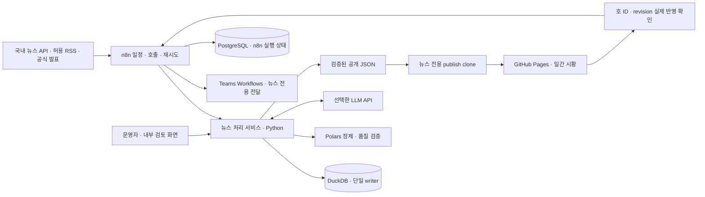

# PRD — 국내 풍력 일간 시황 브리핑 및 n8n 운영

- 작성일·조사 기준일: 2026-09-22
- 상태: 요구사항 v1.1 기준 코드 구현. 실제 발간·서버 연계 검증은 별도 진행
- 요구사항 갱신일: 2026-09-30 — 사용자 지정 저장소·뉴스 지속 축적·웹 우선 조회 반영
- 대상: `jung372/BRE-Workflow-Automation2`
- GitHub 저장소(사용자 확정): <https://github.com/jung372/BRE-Workflow-Automation2>
- 서비스: <https://jung372.github.io/BRE-Workflow-Automation2/>
- 최신 실행 순서·구축 상태: [기존 n8n 활용 실행계획](PLAN-daily-wind-briefing-n8n.md)
- 설치·구동 안내: [Windows 서버 n8n 구축 가이드](n8n-windows-setup-guide.md)
- 선행 문서: [기존 자동배포 PRD](PRD-auto-deploy.md)

> 2026-09-30 최종 사용자 변경: 일일 수동 검토 대신 공식 Codex CLI의 OpenAI/ChatGPT OAuth 로그인으로 요약(low)과 독립 근거 검증(medium)을 자동 수행한다. 통과 항목만 자동 승인하며 실패 항목은 보류한다. 기존 수동 검토·LLM API 키 가정보다 이 변경을 우선한다. 구체적인 인증·한도·운영 절차는 [구현·운영 안내](wind-news-operations.md)를 따른다.

## 1. 제품 목표와 확정 범위

> 2026-09-30 수집 경로 정정: 네이버 검색 API 현행 약관의 AI 입력 금지·보관 제한으로 기존 네이버 기반 수집 가정은 폐기한다. 영구 DB·OAuth 요약·웹 조회 요구는 유지한다. 저장·AI 처리·요약 게시가 허용된 원 제공자의 수집 경로를 확인한 후 운영을 활성화한다. 자세한 근거와 현재 차단 상태는 [구현·운영 안내](wind-news-operations.md)를 따른다.

기존 공지 모니터링 사이트에 **국내 풍력산업의 주요 사건을 하루 한 번 정리하는 일간 시황**을 추가한다. 독자는 풍력 개발·사업관리·EPC·금융 실무자이며, 매일 여러 언론을 검색하지 않고도 계약, 자금조달, 사고, 주민 수용성, 산업 변화를 파악할 수 있어야 한다.

같은 사건을 다룬 기사 여러 건은 하나의 주제로 묶고 대표기사 하나만 게시한다. n8n이 수집 일정, 처리 호출, 발행, Teams 배포, 실패 재시도를 조율한다. 기사 분류·중복 판정·게시 검증은 테스트할 수 있는 Python 모듈로 구현한다.

일간으로 정리·발간한 뉴스와 자체 요약·사건·호·정정 이력을 DB에 계속 축적한다. 사용자는 Teams 알림 없이도 웹의 고정 주소에서 매일 아침 오늘 브리핑을 읽고 누적된 발간 기사를 검색할 수 있어야 한다. 웹 게시·검색 반영을 발간 완료 기준으로 두고 Teams는 독립적인 보조 알림 채널로 운영한다.

2026-09-30 사용자 요청에 따라 이미 구축된 서버 PC의 n8n을 재사용한다. 아래의 신규 설치·PostgreSQL 구성·기존 단계별 일정은 최초 설계 참고이며, 실제 환경 점검·DB 유지 여부·구현 일정은 연결된 최신 실행계획을 따른다.

### 1.1 사용자 확정 사항

| 항목 | 요구사항 |
|---|---|
| 사이트 구성 | 좌측 메뉴 1번 `공지 모니터링 대시보드`, 2번 `일간 시황` |
| 기사 범위 | 국내 기사만 수집 |
| 주제 | 육상·해상풍력, 관련 산업, EPC, PF 종결, 주요 사고, 민원, MOU 등 |
| 중복 처리 | 동일 내용·주제당 대표기사 하나 |
| 배포 채널 | 웹을 주 조회 채널로 제공, Teams는 별도 보조 알림 |
| 지속 축적 | 발간 기사 메타데이터·자체 요약·사건·호·정정 이력을 DB에 계속 보관 |
| 웹 조회 | 오늘 브리핑·날짜별 보고서·전체 발간 이력 검색. Teams 수신 여부와 독립 |
| 자동화 | n8n 사용 |
| 서버 | 가정에서 운영 중인 Windows 기반 서버 PC 활용 |
| 구축 지원 | 설치부터 구동까지 상세 안내와 가능한 설정 자동화 |

### 1.2 설계 기본값 — 구현 전에 변경 가능한 제안

| 항목 | 기본값 |
|---|---|
| 발행 | 주말·공휴일 포함 매일 08:00 KST 발행 시도, 08:15까지 웹 보고서·누적 검색 반영 목표. Teams 전달은 별도 측정 |
| 집계 구간 | 전일 07:30 이상, 당일 07:30 미만. 별도 지연 수집 규칙 적용 |
| 국내 기사 해석 | 국내 매체의 한국어 기사 중심. 국내 공식 발표는 보완 근거로 사용 |
| 산업 범위 | 국내 풍력 및 국내 기업의 관련 사업. 국내 매체가 보도한 국내 기업의 해외 수주도 포함 가능. 해외 매체 직접 수집·번역과 국내 연관성 없는 해외 단신은 제외 |
| 기사 수 | 하루 핵심 주제 최대 15건. 상위 5건을 Teams에 표시. 최소 건수 강제 없음 |
| 서버 구성 | Windows + 전용 WSL2 Ubuntu 배포판 + Docker Engine/Compose |
| AI | 외부 LLM API 사용을 가정하되 공급자·모델·예산은 미정. 정액 구독만으로 API 사용 가능하다고 가정하지 않음 |
| 운영 전환 | 7일간 비공개 병행 검증 후 품질 기준을 만족하면 자동 발행 |

현재 요청의 산출물은 PRD와 설치 가이드다. 서버 설치, 예약 작업 변경, 유료 API 사용, GitHub 게시, Teams 실발송은 이 문서 작성 과정에서 실행하지 않는다. 구현 착수 시 확정한 대상·채널·비용 범위에서 진행한다.

### 1.3 1차 범위와 후속 범위

**1차 구현:** 좌측 메뉴, 일간·과거 호 조회, 전체 발간 이력의 날짜·키워드·기업·프로젝트·지역·주제 검색, DB 지속 축적, 수집, 분류, 사건 단위 중복 통합, 대표기사 선정, 근거 기반 요약, 웹 발간·독립 Teams 알림, 기존 n8n 연계, 검토·정정·재시도, 백업·복구.

**후속 검토:** 기업·프로젝트별 시계열 분석·변화 추적, 주간 보고, 공급망 통계, 다중 편집자를 위한 고급 편집 화면. 기업·프로젝트명으로 기존 발간 기사를 찾는 검색은 1차 범위다. 1차에는 승인·보류·대표기사 변경을 위한 최소 내부 검토 화면을 제공한다. 이메일 구독·발송과 해외 기사 수집은 현재 범위에서 제외한다. 주가·발전량·SMP·REC 실시간 시세판도 별도 요구사항으로 다룬다.

## 2. 현재 구조와 연동 제약

다음은 2026-09-22 로컬 저장소에서 확인했다. 운영 URL은 웹 조회 도구와 로컬 HTTPS 요청으로 확인을 시도했으나 각각 접근 오류·TLS 연결 오류가 발생했다. 따라서 **운영 화면과 로컬 소스의 일치, 현재 서버 상태, GitHub Pages 게시 설정은 미검증**이며 사이트 장애로 단정하지 않는다.

| 확인 파일 | 현재 동작 | 이번 설계의 적용 |
|---|---|---|
| `index.html`, `assets/styles.css` | 공지 대시보드 단일 화면 | 공통 좌측 메뉴와 본문 영역 추가 |
| `assets/app.js` | 상대경로 `data/status.json` 조회 | 공지 렌더러 유지, 시황 렌더러 분리 |
| `run_local.py` | 스크래핑·발행 진입점, 실행·배포 락 | 기사 수집은 독립 n8n 일정으로 운영 |
| `push_to_github.py` | `data/status.json`, `last_state.json`만 명시적으로 stage·push | 뉴스 전용 publish clone과 게시 경로 사용 |
| `.github/workflows/ci-deploy.yml` | `main` 코드 변경을 검증하고 Windows 서버 배포. 기존 데이터·문서는 제외 | 새 뉴스 데이터 경로도 서버 배포 제외 조건에 추가 |
| `.github/workflows/report.yml`, `logic/detector.py` | 평일 08:30, `last_state.json`의 당일/직전 평일 08시 스냅샷 비교 | 시황은 별도 issue와 전달 이력으로 처리 |
| `README.md` | release·publish clone·runtime 분리 | 뉴스도 코드·게시·영속 데이터 분리 |

GitHub Pages는 정적 파일 호스팅이므로 n8n, 뉴스 DB, 인증이 필요한 편집 API는 가정 서버에서 실행한다. 웹은 검증된 공개 JSON만 읽는다. [GitHub Pages 설명](https://docs.github.com/en/pages/getting-started-with-github-pages/what-is-github-pages)

## 3. 사용자 경험과 화면

### 3.1 화면 구성

```text
┌─────────────────────┬─────────────────────────────────────────────┐
│ BRE 업무 대시보드   │ 일간 풍력 시황                              │
│                     │ 2026.09.22 · 집계 마감 07:30 · 발행 08:00    │
│ 1 공지 모니터링     │ [이전 날짜] [날짜 선택] [다음 날짜]          │
│   대시보드          │                                             │
│ 2 일간 시황         │ 오늘의 핵심 3줄                             │
│                     │ 주제 9건 · 중복 통합 18건 · 일부 출처 지연   │
│                     │ [전체] [육상] [해상] [EPC] [PF] [사고·민원]  │
│                     │ [프로젝트·기업·키워드 검색]                 │
│                     │                                             │
│                     │ [해상][EPC 계약] 기사 제목                  │
│                     │ 핵심 사실 / 사업상 확인할 점               │
│                     │ 매체 · 기사 시각 · 대표기사 원문 보기       │
└─────────────────────┴─────────────────────────────────────────────┘
```

위 숫자·날짜는 화면 예시이며 실제 집계 결과가 아니다.

- 기본 진입 화면은 공지 모니터링. URL은 `#/notices`, `#/daily`, `#/daily/YYYY-MM-DD`로 구분한다.
- 기존 루트 주소와 상대경로 자산 로딩을 유지한다. 프로젝트 경로 `/BRE-Workflow-Automation2/` 아래에서 동작해야 한다.
- 과거 호 공유 URL을 열거나 새로고침해도 같은 호가 보인다. 존재하지 않는 날짜는 명확한 안내와 최근 호 링크를 제공한다.
- 데스크톱은 좌측 메뉴 고정, 모바일은 접이식 메뉴. 360px 화면에서 가로 넘침이 없어야 한다.
- 키보드 탐색, 선택 메뉴 `aria-current`, 읽을 수 있는 대비, 로딩·오류·빈 결과 상태를 제공한다.

### 3.2 일간 시황 표시 규칙

아침 확인용 고정 주소는 `https://jung372.github.io/BRE-Workflow-Automation2/#/daily`로 제공한다. `일간 시황` 안에 오늘 브리핑·날짜별 보기·누적 기사 검색을 두고, 공지 대시보드에도 최신 브리핑 날짜·상태와 바로가기를 표시한다. 고정 주소·검색 주소는 구현 예정이며 현재 동작을 확인한 주소가 아니다.

1. 실제 발행일, 집계 구간, 최신 확인 시각, 발행 상태를 표시한다. 이전 호를 오늘 기사로 표시하지 않는다.
2. 상단 핵심 요약은 게시된 기사만 근거로 최대 3줄 작성한다. 기사 수가 적으면 줄 수를 줄인다.
3. 목록은 중요도순, 각 사건은 주 분류 한 곳에 한 번 표시한다. 필터는 복수 태그를 지원하되 전체 목록에서 중복 렌더링하지 않는다.
4. 카드에는 제목, 2~3문장 요약, 국내 지역·기업·프로젝트, 주제 태그, 매체, 기사 시각, 원문 링크를 표시한다.
5. 계약 금액·용량·당사자·일정은 원문에 명시된 값만 사용한다. 미확인 값은 공란 또는 `미공개`로 표시한다.
6. `사업상 확인할 점`은 선택 필드이며 사실 요약과 시각적으로 구분한다. 근거 없는 전망이나 투자 권유를 생성하지 않는다.
7. 동일 사건의 다른 기사 목록은 공개 카드로 추가하지 않는다. 내부 검토 화면에서만 군집 구성과 선정 사유를 조회한다.
8. 원문 접근 범위가 제목·검색 요약뿐이면 `제목·검색 요약 기준`을 표시하고 그 범위 밖 내용을 생성하지 않는다.

당일 08:15 KST 이후에도 최신 호 날짜가 전일이면 브라우저가 날짜를 비교하여 `오늘 브리핑 발행 지연`을 표시한다. 서버 전체 중단으로 오류 상태조차 게시하지 못하는 경우에도 이전 호를 당일 정상 결과로 오인하지 않도록 한다.

누적 검색은 `#/daily/archive`에서 발간된 모든 기간의 기사를 대상으로 제공한다. 기본 최근 30일과 전체 기간 선택을 명시하고, 브리핑 발행일 범위·제목/자체 요약 키워드·기업·프로젝트·지역·발전 유형·사건 분류로 필터링한다. 최신순·과거순 정렬과 검색 조건 URL 보존을 지원한다. 결과에는 기사시각·브리핑 날짜·요약·출처·원문 링크·해당 호 링크를 표시한다. 정정 호는 최신 유효 revision을 기본으로 사용하고 미발간·보류 기사는 공개하지 않는다. 일간 15건 제한은 누적 보관 한도가 아니다.

접속·탭 재활성화·새로고침 시 최신 manifest를 재확인한다. 08:15 이전 당일 호가 없으면 준비 중, 이후에는 지연으로 표시한다. 검색은 월별 인덱스를 필요한 범위만 읽고, 전체 기간의 진행률·완료 범위를 표시한다. 일부 월을 읽지 못하면 검색 불완전 안내와 재시도를 제공하며 결과 0건으로 처리하지 않는다.

### 3.3 빈 호와 실패 상태

| 상태 | 웹 | Teams |
|---|---|---|
| 정상 수집, 선정 0건 | 해당 날짜 호에 `오늘 새로 선정된 주요 기사가 없습니다` | 동일 내용의 짧은 일간 카드 1회 |
| 일부 출처 장애, 나머지 유효 | `일부 출처 수집 지연`과 확인 시각 표시 | 같은 상태 표기 |
| 전 출처 장애·필수 출처 실패 | 최근 정상 호 유지, 최신성 경고. 당일 성공 호를 만들지 않음 | 운영자 장애 알림만 전송 |
| 요약·수치 검증 실패 기사 | 해당 기사 검토 보류, 나머지로 발행 가능 | 보류 기사는 제외 |
| Pages 반영 지연 | 기존 호 유지, 최신 요청 실패 시 경고 | 새 호 링크 검증 후 배포 |

## 4. 기사 수집·분류

### 4.1 수집원과 검색 전략

국내 뉴스 발견에는 네이버 뉴스 검색 API를 우선 사용한다. API의 `originallink`, `link`, `title`, `description`, `pubDate`를 구분해 저장한다. `description`은 기사 전문이 아니며, `pubDate`도 기사 원문의 최초 발행시각과 같다고 가정하지 않는다. 문서상 호출 한도·페이지 제한을 확인하고 실제 계정 한도를 구현 시 재확인한다. [네이버 뉴스 검색 API](https://developers.naver.com/docs/serviceapi/search/news/news.md)

| 수집원 | 역할 | 채택 조건 |
|---|---|---|
| 네이버 뉴스 검색 API | 국내 언론 기사 발견, 검색어별 최신 결과 | 사용자 소유 API 앱, 실제 응답·쿼터 검증 |
| 국내 매체 공식 RSS·허용 API | 검색 누락 보완 | 피드 존재·접근·이용 조건·갱신 주기 확인 |
| 국내 기업·기관 공식 발표 | 계약 단계·금액·당사자 교차 확인 | 허용된 공개 페이지, 사이트별 수집 어댑터 |
| 일반 기사 HTML | 허용된 경우 본문 추출 | 이용 조건과 접근 범위 확인, paywall 우회 없음 |

전기신문·에너지경제신문·이투뉴스 등 국내 에너지 전문지와 종합 경제 매체는 **후보 출처**이며 RSS 제공·자동 수집 허용 여부를 확인한 목록이 아니다. 실제 사용 도메인·방식·활성 여부·담당자·검토일을 `config/wind_news_sources.json`에 기록한다.

검색어는 `풍력`, `육상풍력`, `해상풍력`, `부유식`, `풍력 EPC`, `풍력 금융약정`, `풍력 PF`, `풍력 사고`, `풍력 주민`, `풍력 MOU`, `터빈`, `해저케이블`, `하부구조`, `설치선`, `풍력 O&M` 등을 초기 후보로 한다. 공급망 단어만으로 수집된 기사는 실제 풍력 연관성을 추가 검증한다. 이 설정은 기존 공지용 `config/keywords.json`과 분리한다.

검색 응답을 날짜순으로 페이지 순회하고, 커서·상한·포화 여부를 기록한다. 검색 결과 상한에 닿으면 키워드를 세분화하거나 허용된 보조 출처로 보완하고 `coverage_incomplete`를 남긴다. 검색 API 결과를 국내 전체 기사 전수로 표현하지 않는다.

### 4.2 분류 체계

| 축 | 값 |
|---|---|
| 발전 유형 | 육상 / 고정식 해상 / 부유식 해상 / 공통 / 미확인 |
| 사건 | EPC·시공 / 금융·PF / 터빈·공급계약 / 인허가·정책 / 사고·안전 / 민원·수용성 / MOU·협약 / 착공·준공·상업운전 / 산업·공급망 / 기타 주요 동향 |
| 계약 단계 | 검토 / 우선협상 / MOU / 본계약 / 조건부 계약 / 금융약정 / 금융종결 / 실행 / 해지·변경 / 미확인 |
| 추가 정보 | 사업명, 법인·SPC, 위치, 당사자 역할, 금액·통화, MW, 사건일, 기사시각 |

**필수 의미 규칙:** MOU를 수주 확정으로, 대출 약정을 금융종결로, 금융종결을 대출 실행으로 자동 치환하지 않는다. `PF 종결`은 해당 단계가 근거에서 확인되는 경우에만 표시한다. 원문 표현이 애매하면 `금융약정—종결 여부 미확인`처럼 표시한다.

사고 원인·책임·피해 규모는 확인된 사실과 조사 중인 사항을 나눈다. 민원은 제기 주체와 주장임을 명시하고 개인의 연락처·주소 등 불필요한 식별정보를 공개하지 않는다. 최초 도입 시 주요 사고·분쟁·민원 기사는 편집자 확인 대상으로 둔다.

### 4.3 시각·증분 수집

- 저장은 시간대가 포함된 ISO 8601/UTC, 표시와 호 날짜는 `Asia/Seoul` 기준이다.
- `source_published_at`, `source_modified_at`, `discovered_at`, `event_date`, `timestamp_basis`를 구분한다. 시간이 없으면 임의로 오늘 날짜를 채우지 않는다.
- 매시 05분 수집하고 최근 72시간을 겹쳐 조회한다. 07:30에는 마감 수집을 추가한다.
- 호의 일반 기사 범위는 전일 07:30~당일 07:30. 72시간 안의 늦게 발견된 미발행 기사는 `지연 수집`으로 편입할 수 있다.
- 같은 URL·사건을 재수집해도 다시 발행하지 않는다. 이미 처리한 시점은 성공한 수집원별로만 전진한다.
- 장애가 72시간을 넘으면 마지막 성공 지점까지 복구 수집을 시도한다. 공급자 조회 제한으로 복구하지 못한 구간은 누락 기간으로 기록한다.
- 발행 기준시각이 당일 07:30 이상인 기사는 다음 호 대상이다. 07:30 마감 수집의 응답이 그 이후 도착해도 기준시각이 집계 구간 안이면 포함한다. 준비 작업은 해당 수집의 완료를 확인한 시점에 입력 batch 목록을 고정하며, 고정 이후 발견한 기사는 다음 호의 지연 수집 대상으로 처리한다. 중요한 정정은 당일 호 개정 절차로 처리한다.

## 5. 사건 단위 중복 통합과 대표기사

### 5.1 중복 판정 순서

1. **동일 기사:** 원문 URL 정규화, 공급자 기사 ID, 정규화 제목·본문 해시로 제거한다. 추적 파라미터만 제거하고 기사 ID인 쿼리는 보존한다.
2. **후보 사건 묶음:** 사업명·SPC·지역·당사자·사건 유형·계약 단계·사건일을 사용한다. 언론사명·표제의 차이는 동일 사건일 수 있다.
3. **유사도 보조:** 제목·허용 본문/요약의 유사도로 후보를 좁힌다. 임베딩·LLM 결과만으로 사업·단계 불일치를 무시하지 않는다.
4. **검증 후 통합:** 동일 프로젝트·동일 사건 단계·일치하는 주요 사실을 확인한다. 판단 근거, 규칙·모델 버전, 불확실성을 기록한다.
5. **과거 호 비교:** 최근 7일 군집을 우선 비교하고, 동일 기사 ID·기발행 사건 키는 전체 이력으로 확인한다. 새 사실 없는 재보도는 제외한다.

유사도 임계값은 고정 정답으로 선언하지 않는다. 국내 실제 표본으로 튜닝하고 모델이 바뀌면 다시 평가한다. 확실하지 않은 후보는 검토로 넘긴다. A-B, B-C가 유사하다는 이유만으로 A-C를 무조건 합치지 않는다.

| 기사 조합 | 판정 |
|---|---|
| 같은 해상풍력 EPC 체결을 보도한 국내 5개 매체 | 사건 1개, 대표기사 1개 |
| 같은 사업 MOU 발표와 이후 EPC 본계약 | 다른 사건, 각각 발행 가능 |
| 같은 사업 금융약정과 이후 금융종결 | 다른 사건 또는 후속 사건으로 연결 |
| 동일 이름, 다른 지역의 풍력사업 | 별도 사건 |
| 같은 사고의 초기 보도와 후속 원인 조사 결과 | 새 사실이 있으면 후속 사건, 변경점 명시 |
| 동일 민원의 여러 재인용 | 1개 사건. 공식 답변·합의는 후속 사건 가능 |
| 같은 회사가 서로 다른 사업에서 체결한 계약 | 별도 사건 |

### 5.2 대표기사 선정

선정 가능한 국내 기사에 대해 신뢰 가능한 출처·원취재 여부(30), 핵심 사실의 명확성(25), 정보 충실도(20), 원문 접근성(15), 최신 정정 반영(10)의 합산 점수를 사용한다. 각 점수의 판단 근거를 남기고 동점이면 정정 반영, 최초 보도시각, 정규화 URL 순으로 결정한다. 점수는 초기 정책이며 표본 검증 후 조정한다.

공식 발표는 교차 검증 근거로 활용한다. 대표기사 요약에 다른 기사에서만 확인된 사실을 몰래 합치지 않는다. 핵심 수치가 충돌하거나 대표기사 자체에 근거가 부족하면 보류하거나 확인된 부분만 게시한다.

편집자는 대표기사 교체·군집 분리/병합·제외를 수행할 수 있어야 한다. 자동 판정과 수동 변경을 별도 이력으로 남기고 다음 자동 실행이 수동 결정을 덮어쓰지 않게 한다.

## 6. 요약과 편집·발행 정책

- AI 입력은 허용된 기사 텍스트와 메타데이터로 제한한다. 기사 안의 명령문은 데이터로 취급한다.
- 출력 스키마에 제목, 사실 요약, 분류, 수치, 근거 구간 ID, 불확실성, 검토 사유를 포함한다.
- 금액·통화·MW·날짜·회사명·계약 단계는 원문 근거와 기계적으로 대조한다. 원/억원, kW/MW, 총사업비/계약금액을 구분한다.
- 요약은 원문 복제를 최소화한 독자적 문장으로 작성한다. 기사 전문·사진·유료 콘텐츠를 공개 저장소에 넣지 않는다. 출처별 이용 조건을 활성화 전에 확인한다.
- 초기 7일은 비공개 초안을 검토한다. 운영 전환 후 검증 통과 기사는 자동 게시하고, 민감·불확실 기사는 운영자가 확인한 경우에 게시한다.
- 검토자는 가정 서버의 인증된 내부 검토 화면에서 초안과 원문을 보고 승인·보류·제외한다. n8n은 검토 상태를 조회해 다음 단계를 진행한다. 공개 Pages에는 쓰기 API나 관리자 비밀번호가 없다.
- 마감 시 보류 항목은 해당 호에서 제외한다. 보류 항목이 있는 호는 `일부 항목 검토 중`을 표시한다. 주요 사실을 추측해 발행 일정을 맞추지 않는다.
- 게시 후 변경은 동일 `issue_id`의 `revision`을 올리고 정정 사유·시각을 공개한다. 초안 수정만으로 기존 승인 결과를 재사용하지 않으며 승인한 내용 해시와 발행 내용 해시가 같아야 한다.
- 통상 정정은 웹에 반영한다. 이미 배포된 핵심 사실이 바뀌면 `정정` Teams 카드 1회를 별도 전달 키로 처리한다.

## 7. 구성과 책임



| 구성요소 | 책임 |
|---|---|
| n8n | 일정, 소스 호출 흐름, 처리 서비스 호출, 상태 분기, 배포 호출, 재시도, 알림 |
| Python 서비스 | 출처별 파싱, 정규화, 분류, 군집, 요약 검증, 편집 이력, 공개 스냅샷 생성, 전달 원장 |
| DuckDB + Polars | 기사·사건·호 이력, 품질검사, 검증 스냅샷, 필요 시 Parquet |
| PostgreSQL | n8n 내부 DB. 뉴스 원문·분류의 원본 저장소로 사용하지 않음 |
| GitHub Pages | 공지와 뉴스 공개 조회 |
| Teams | 새 호 요약·링크 및 정정 알림 |

n8n은 PostgreSQL과 영속 볼륨을 사용한다. 뉴스 분석 저장소는 프로젝트 지침에 따라 DuckDB+Polars를 사용한다. n8n 여러 노드가 DuckDB 파일을 직접 여는 방식은 금지하고, **한 프로세스의 writer 큐**로 모든 변경을 직렬화한다. 대기 중인 작업도 먼저 영속화한 뒤 접수 성공을 응답한다.

규칙·프롬프트·모델 선택은 버전 관리한다. n8n의 Code 노드에 기사 처리 전체를 복제하지 않고, 일반 HTTP API와 Python 모듈로 이식 가능하게 만든다.

## 8. n8n 워크플로 명세

워크플로 이름과 서비스 API는 구현 예정 계약이며 현재 존재하는 기능이 아니다.

| ID | 시작 조건 | 주요 단계 | 완료 기준 |
|---|---|---|---|
| WF-01 Collect | 매시 05분, 별도 07:30 마감 수집 | Schedule Trigger → 설정 조회 → HTTP/RSS → 출처별 오류 분기 → 배치 ingest → 처리 작업 조회 | 출처별 성공/0건/실패·페이지 포화 기록, 적재 ID 확보 |
| WF-02 Prepare | 매일 07:40 | 마감 수집 완료 확인 → 사건 통합 → 대표 선정 → 요약 → 검증 → 초안 저장 | `READY` 또는 `REVIEW_REQUIRED`/`BLOCKED` |
| WF-03 Publish | 08:00 및 제한된 재시도 | 호 락 → 승인·품질 재검사 → DB 기반 호·검색 JSON → Git 게시 → Pages 반영 확인 → 전달 대기 기록 | 공개 호·검색 반영 확인. Teams 결과와 독립 |
| WF-04 Deliver | 웹 반영 확인 후 | 전달 원장 claim → Teams 카드 → 응답/흐름 결과 기록 | `ACCEPTED`와 실제 전달 확인 `DELIVERED` 구분 |
| WF-05 Recovery | Error Trigger + 5분 주기 감시 | 멈춘 작업·누락 일정 탐지 → 허용된 단계 재시도 → 운영자 알림 | 실패 원인·다음 조치 확인 가능 |
| WF-06 Backup | 일 1회 비혼잡 시간 | DB 일관성 확보 → 암호화 백업 → 다른 위치 복제 → 결과 기록 | 복구 가능한 백업 생성 확인 |

- Schedule Trigger와 workflow timezone은 모두 `Asia/Seoul`로 명시한다. 활성화/게시 상태와 다음 실행시각을 점검한다.
- 긴 처리 요청은 `202 + job_id`를 반환하고 n8n은 제한된 간격으로 조회한다. 재호출은 동일 idempotency key를 사용한다.
- HTTP 429·일시적 5xx·타임아웃은 지수 지연과 최대 횟수로 재시도한다. 401/403·스키마 변경·검증 실패는 무한 재시도하지 않는다.
- 수집 주기 최대 20분, 호 준비 최대 15분을 초기 제한으로 두고 측정 후 조정한다. 마감 의존 작업이 끝나지 않으면 이전 결과로 성공 처리하지 않는다.
- n8n 내부 동시 실행 제한과 별도로 `issue_date`별 서비스 락을 적용한다. 수동 실행도 락·전달 원장을 우회하지 못한다.
- 재기동 후 마지막 완료 호를 비교하여 누락 실행을 보충한다. 오래된 미발행 호는 보관용으로만 복구하고 Teams에 연속으로 발송하지 않는다. 최신 유효 호만 배포한다.

## 9. 데이터 계약과 게시 원자성

### 9.1 내부 저장

| 데이터 | 주요 키·필드 |
|---|---|
| `articles` | `article_id`, 공급자 ID, 원문·정규화 URL, 출처, 기사 시각과 근거, 제목, 허용 본문 범위, 해시, 수집 상태 |
| `events` | `event_id`, 프로젝트·당사자·사건 종류·단계·사건일, 과거 사건 연결, 대표기사, 판정 버전 |
| `event_articles` | 사건-기사 관계, 통합 근거, 선정 점수, 수동 결정 |
| `issues` | `issue_id`, KST 날짜, revision, cutoff, 상태, 내용 해시, 품질 지표, 공개 경로, commit SHA |
| `issue_items` | 호별 순위, 사건 ID, 대표기사의 고정 스냅샷, 요약·근거, 승인 해시 |
| `jobs`, `source_runs` | 실행 ID, idempotency key, 출처별 watermark·건수·오류·누락 기간 |
| `deliveries` | 호·채널·revision별 유일 키, pending/claimed/accepted/delivered/failed/unknown, 응답 증거 |
| `editorial_actions` | 검토자, 시각, 이전/이후 상태, 사유, 변경 내용 해시 |

본문 수집과 관련된 권리 제한은 출처별로 적용한다. 발간 기사 메타데이터·자체 요약·관련 사건·호·정정 이력·재현용 근거 해시와 메타데이터는 자동 만료 없이 지속 보관한다. 2년이 지났다는 이유로 삭제하지 않는다. 미발간 후보 메타데이터 2년, 원천 허용 텍스트 최대 30일, 민감정보를 제거한 운영 로그 30일은 초기 보존안으로 유지한다. 후보 정리 시 발간 호가 참조하는 데이터를 보호한다. 더 짧은 출처별 조건이나 권리상 조치가 필요하면 그 조건을 우선하고 변경 이력을 남긴다. 기사 전문의 영구 저장을 뜻하지 않는다.

DuckDB의 검증된 스냅샷에서 공개 호와 검색 인덱스를 생성한다. 브라우저는 게시된 정적 JSON을 읽으며 서버 DB나 사설 n8n에 직접 연결하지 않는다. 이미 게시된 자료는 서버 PC·Teams 장애 중에도 Pages가 제공 가능한 동안 조회할 수 있다. DB 백업으로 전체 호·검색 자료를 재생성할 수 있어야 한다.

### 9.2 공개 JSON

```text
data/wind-news/index.json
data/wind-news/latest.json
data/wind-news/issues/2026/09/2026-09-22.r1.json
data/wind-news/issues/2026/09/2026-09-22.r2.json
data/wind-news/search/manifest.json
data/wind-news/search/YYYY/YYYY-MM.<snapshot-id>.json
```

`latest.json`과 `index.json`은 immutable 호 파일을 가리키는 manifest다. 과거 날짜 URL은 index를 통해 해당 날짜의 최신 revision을 찾는다. 검색 manifest는 월·건수·불변 검색 파일 경로·해시·스냅샷 버전을 담는다. 검색 항목에는 호·기사·사건 ID, 발행일·revision, 제목·자체 요약·분류·기업·프로젝트·지역·출처·기사시각·호 경로를 둔다. 동일 호의 정정 전 항목을 최신 항목과 중복 표시하지 않는다. 아래는 호 계약 예시이며 실제 기사가 아니다.

```json
{
  "schema_version": 1,
  "issue_id": "wind-2026-09-22",
  "issue_date": "2026-09-22",
  "revision": 1,
  "timezone": "Asia/Seoul",
  "window_start": "2026-09-21T07:30:00+09:00",
  "window_end": "2026-09-22T07:30:00+09:00",
  "published_at": "2026-09-22T08:00:00+09:00",
  "content_status": "no_news",
  "coverage": {"expected_sources": 3, "successful_sources": 3, "partial": false},
  "counts": {"fetched": 0, "eligible_articles": 0, "merged_duplicates": 0, "published_topics": 0, "held": 0},
  "headline_summary": [],
  "items": []
}
```

각 `items[]`에는 `event_id`, `representative_article_id`, `headline`, `summary`, `primary_category`, `tags`, `source_name`, `source_url`, `source_published_at`, `timestamp_basis`, `evidence_scope`, `project_name`, `region`, `contract_stage`, `late_arrival`을 둔다. 금액·통화·용량은 값과 단위를 나누고, 미확인 값은 `null`로 저장한다. 원문 링크는 검증된 HTTPS URL만 허용한다.

내부 발행 상태는 `DRAFT → READY → COMMITTED → WEB_VERIFIED`로 관리하고 `REVIEW_REQUIRED`, `BLOCKED`, `FAILED`를 별도 기록한다. 공개 내용 상태 `normal / partial / no_news`와 내부 전달 상태를 혼용하지 않는다. manifest에는 대상 파일 경로와 SHA-256을 포함하며, 실제 외부 반영시각 `web_verified_at`은 내부 발행 원장에 남긴다.

### 9.3 게시 절차와 충돌 처리

1. 내부 스냅샷을 검증하고 공개 필드 allowlist로 JSON을 만든다. 초안·원문 전문·검토자·자격증명은 제외한다.
2. 뉴스 전용 publish clone에서 원격 최신 이력을 가져온다. 기존 공지 publish clone을 공유하지 않는다.
3. `data/wind-news/**`만 stage하고 동일 DB 스냅샷에서 생성한 immutable 호 파일·index·latest·변경된 월의 검색 파일·검색 manifest를 한 commit에 포함한다. 변경 없는 월은 재사용한다. force push와 포괄적인 `git add -A`를 사용하지 않는다.
4. 공지 게시와 원격 push가 충돌하면 최신 원격 위에서 뉴스 변경만 재적용하고 검증 후 제한 횟수 재시도한다. 공지 데이터 충돌을 임의 해결하지 않는다.
5. Git push 성공 이후 Pages의 실제 JSON을 조회해 호 ID·revision·내용 해시와 검색 manifest·변경된 월의 해시·항목 수가 맞아야 `WEB_VERIFIED`로 전환한다. 웹 완료와 Teams 전달 대기를 영속 기록하고 전달은 별도 실행한다.
6. 브라우저는 manifest와 호의 버전을 확인한다. 캐시 불일치 시 재조회하고, 실패하면 마지막 유효 호를 보여준다.
7. `.github/workflows/ci-deploy.yml`에는 `data/wind-news/**`만 데이터 변경 제외 경로로 추가한다. 뉴스 코드·설정의 검증까지 제외하지 않는다.

현재 `push_to_github.py`의 `[skip ci]`를 뉴스 게시에 그대로 복사하지 않는다. Pages 게시 방식과 인증 수단에 따라 빌드 트리거가 달라질 수 있다. 특히 Actions의 `GITHUB_TOKEN`으로 수행한 commit이 branch 기반 Pages 빌드를 자동 유발한다고 가정하면 안 된다. 구현 M0에서 실제 설정을 조회하고, 필요한 경우 명시적 Pages 배포 workflow를 설계한다. [Pages 게시 원본과 빌드 조건](https://docs.github.com/en/pages/getting-started-with-github-pages/configuring-a-publishing-source-for-your-github-pages-site)

## 10. Teams 배포

뉴스 전용 제목 `[풍력 일간 시황] YYYY-MM-DD`와 상위 5건의 제목·짧은 요약, 전체 주제 수, 집계 마감시각, 해당 날짜 웹 링크를 담는다. 일부 수집 지연·검토 보류·정정 여부를 함께 표시한다. 기존 공지 보고와 별도 메시지로 구분하되 같은 채널 사용 여부는 사용자가 정한다.

신규 연계는 Teams Workflows의 webhook 수신 방식을 우선 검토한다. 공식 문서는 workflow가 사용자 소유이며 공동 소유자 지정으로 운영 연속성을 확보하도록 안내한다. 실제 테넌트의 사용 가능 여부·인증 방식·카드 지원을 테스트한다. 기존 공지용 webhook을 읽거나 복제하지 않고 뉴스용 credential을 따로 등록한다. [Microsoft Teams webhook 안내](https://learn.microsoft.com/en-us/microsoftteams/platform/webhooks-and-connectors/how-to/add-incoming-webhook)

- `issue_id + channel_id + revision + message_type`를 유일 전달 키로 사용한다.
- 송신 전 원장 claim, 성공 응답 후 상태 저장, 명확한 실패만 재시도한다.
- 수신 측 timeout은 이미 전달됐을 수 있으므로 `UNKNOWN`으로 남기고 결과 확인 후 재처리한다. webhook만으로 종단 간 exactly-once를 보장한다고 주장하지 않는다.
- webhook의 2xx는 요청 접수로 기록한다. Teams workflow 실행 결과나 메시지 증거가 있으면 `DELIVERED`로 표시한다. 관찰 수단이 없는 경우 `ACCEPTED`로 유지한다.
- Teams 장애·알림 누락·연결 미설정이 DB 축적·웹 발간·누적 검색 갱신을 막거나 웹 완료 상태를 되돌리지 않는다. 웹이 확인되지 않으면 정상 발행 알림을 보내지 않는다. 전달 대기를 원장으로 관리하여 복구 시 전송 단계만 재개한다.

## 11. 가정 Windows 서버 운영 요구사항

### 11.1 권장 구성

Windows 서버 PC에 뉴스 전용 WSL2 Ubuntu 환경을 만들고 Docker Engine + Compose로 `n8n`, `postgres`, `news-service`를 구동한다. 운영 접근에 필요하면 HTTPS reverse proxy를 추가한다. 기존 Windows의 BRE Scraper·runner·release 포인터는 별도로 유지한다.

WSL 설치 가능 여부는 실제 Windows 에디션·빌드·가상화 지원을 확인해 결정한다. 지원되는 Windows 설치·배포판 선택 방법은 Microsoft 문서를 기준으로 한다. [WSL 설치](https://learn.microsoft.com/en-us/windows/wsl/install)

- 초기 자원 예산 제안: 기존 업무 자원을 제외하고 CPU 2코어 수준, RAM 4GB 이상, 여유 디스크 30GB 이상. 실제 수집량과 외부 LLM 사용 여부로 부하 시험 후 조정한다. 확정 최소 사양이나 실측값이 아니다.
- DB·Docker 볼륨·뉴스 runtime은 WSL의 Linux 파일시스템에 둔다. `/mnt/c`, `/mnt/d`, OneDrive 위에서 DB를 직접 운영하지 않는다.
- 개발 소스, 릴리스, publish clone, runtime, 백업을 분리한다. 기존 runtime의 `.env`·MetMast·프록시·Teams 비밀값에 접근하지 않는다.
- n8n은 선택한 stable 버전과 이미지 digest를 고정한다. PostgreSQL 버전·볼륨 경로도 함께 고정하고 업데이트 전 복원 시험을 한다.
- n8n 편집기는 운영자용 private 접근으로 제공한다. 공개 GitHub Pages에서 n8n으로 직접 요청하지 않는다.
- 기본 운영은 단일 n8n 인스턴스다. Redis 기반 queue mode와 임의 코드 실행 sandbox는 초기 요구사항에 포함하지 않는다.

n8n 공식 Compose 문서에는 설치와 PostgreSQL 구성이 안내되어 있다. 이 프로젝트는 해당 문서의 전체 Assistant 부가 스택을 그대로 설치하는 대신 필요한 서비스만 구성한다. [n8n Compose 설치](https://docs.n8n.io/deploy/host-n8n/install-options/install-using-docker-compose.md)

### 11.2 무인 복구·보안·백업

- Windows 시작 시 배포판 소유 계정으로 전용 시작 작업 실행 → WSL 구동 → Docker 준비 확인 → Compose 구동 → 상태 감시 순으로 진행한다. 기존 작업의 이름·트리거를 재사용하지 않는다.
- 컨테이너 `restart` 정책만으로 Windows 재부팅·로그아웃 후 WSL 구동까지 보장된다고 보지 않는다. 재부팅 후 로그인 없이 10분 내 정상화, 로그아웃 후 24시간 수집 지속을 통과해야 운영 가능하다.
- WSL 무인 실행을 안정적으로 충족하지 못하면 동일 PC의 자동 시작 가능한 Linux VM으로 전환한다. OS 에디션별 VM 지원 여부도 확인한다.
- sleep·전원·자동 업데이트 정책은 기존 운영 작업에 미치는 영향을 확인한 뒤 정한다. 공유 WSL 설정을 일괄 변경하지 않는다.
- API 키·webhook·암호화키는 보호된 runtime 또는 n8n Credentials에 저장한다. stdout, workflow export, 실행 오류 데이터, 공개 저장소에 유출되지 않도록 한다.
- n8n 암호화키는 최초 한 번 생성해 유지하고 DB와 별도 보관한다. PostgreSQL만 복구하고 키를 잃으면 credential 복원이 안 되는 상황을 방지한다.
- 기사 URL은 HTTPS, 허용 도메인, redirect 목적지를 검증한다. 내부 IP·metadata endpoint 접근과 스크립트 URL을 차단한다. 화면은 HTML escape 처리한다.
- LLM에는 승인된 기사 텍스트만 전달한다. n8n credential, 네트워크 설정, 내부 운영 정보는 프롬프트에 포함하지 않는다.
- 일 1회 PostgreSQL 논리 백업, DuckDB writer 중지·checkpoint 후 일관된 백업, 암호화키·설정·workflow 버전 백업을 수행한다. 동일 디스크 외 위치에 암호화 복사한다.
- 복구 목표 제안: RPO 24시간, RTO 4시간. 월 1회 격리 복원과 비공개 호 재생성을 검증한다.
- n8n 중단 자체를 감지할 수 있도록 Windows 측 외부 감시를 둔다. 시황만 실패해도 기존 공지 수집을 재시작하지 않는다.

## 12. 품질·운영 수용 기준

아래 수치는 출시 목표이며 측정 결과가 아니다. 검증 표본과 산식, 실행 로그를 함께 남긴다.

| ID | 기준 | 검증 방법 |
|---|---|---|
| AC-01 | 좌측 메뉴 순서·기본 진입·직접 링크·모바일 동작 | PC와 360px 브라우저 확인 |
| AC-02 | 기존 공지 목록·갱신·Teams 비교 기준 유지 | 기존 unittest와 fixture 회귀 |
| AC-03 | 국내 출처 규칙, 필수 8개 주제 처리 | 출처·주제별 fixture와 실제 허용 표본 |
| AC-04 | 동일 사건 병합 precision ≥95%, recall ≥90% | 국내 기사 200쌍 이상, 50개 사건 이상 수동 라벨; 튜닝·평가셋 분리 |
| AC-05 | MOU/EPC/금융약정/금융종결/실행 단계 오병합 0건 | 필수 반례 fixture 전건 통과 |
| AC-06 | 표본의 계약 금액·MW·회사·시각·단계 근거 일치 100% | 대표기사 최소 50건 대조, 미확인 값 비생성 |
| AC-07 | 같은 job·호 재실행 시 공개 항목·정상 전달 중복 0건 | 재시도, crash, 타임아웃, UNKNOWN 상태 fault injection |
| AC-08 | 성공 0건·파싱 실패·전면 장애·부분 장애 구별 | 모의 응답으로 UI와 게시 정책 확인 |
| AC-09 | 운영 첫 30일 중 95% 이상 08:15 내 웹 보고서·누적 검색 반영 | 웹 발간 지표와 Teams 요청 접수율을 별도로 측정. 외부 장애 원인 분리 |
| AC-10 | 수신 확인 가능한 Teams 연계 및 첫 실제 메시지 확인 | 요청 접수와 채널 메시지 증거 별도 기록 |
| AC-11 | 공지·뉴스 동시 push 시 데이터 소실·force push 0건 | 격리 bare Git 원격으로 동시성 시험 |
| AC-12 | 뉴스 데이터 push로 Windows 코드 재배포 미발생, Pages는 실제 갱신 | staging과 운영 최초 게시의 workflow·JSON 확인 |
| AC-13 | Windows 재부팅 후 로그인 없이 10분 내 복구, 로그아웃 후 24시간 지속 | 서버 현장/원격 운영 시험 |
| AC-14 | 실제 백업으로 DB·키·워크플로·호 복구 | 격리 복구 환경에서 인증·호 생성 검증 |
| AC-15 | API 키·webhook·원문 전문이 공개 산출물에 없음 | 공개 필드 schema 검증·export·Git diff 검사 |
| AC-16 | Teams와 독립적으로 당일 웹 보고서·검색 제공 | Teams 실패·미설정 조건에서 DB 저장·웹 발간 성공, 고정 주소 직접 조회 확인 |
| AC-17 | 전체 발간 이력의 날짜·키워드·기업·프로젝트 검색 | 여러 월·여러 해 fixture, 복합 필터·전체 기간·정정·검색 일부 실패·보류 비노출·모바일 검증 |
| AC-18 | 발간 데이터 지속 보존 및 공개 자료 재생성 | 2년 경과·재실행 시 보존/중복 검증, 백업 DB에서 전체 호·검색 인덱스 재생성 및 건수·해시 대조 |

기사 적합도, 보류율, 출처별 실패율, 중복 제거율, LLM 비용, 처리 지연, 검토 소요시간도 추적한다. `수집 원문 수`, `적합 기사 수`, `통합된 중복 수`, `게시 사건 수`, `보류 수`를 구분하며 서로 다른 분모를 혼용하지 않는다.

웹 운영 개시와 Teams 알림 개시는 별도로 판정한다. 웹·DB·검색 품질을 통과했으나 Teams 실제 전달 기준 AC-10이 남은 경우 웹은 제공하고 알림 준비는 미완료로 표시한다. Teams 장애나 미설정 상태에서도 아침 직접 조회가 가능한지 AC-16으로 확인한다.

필수 출처는 M0에서 정한다. 초기 정책은 주 발견 API 성공 + 활성 필수 출처 전부 성공을 정상 발행 조건으로 두고, 선택 출처 실패만 `partial`로 허용한다. 필수 출처 장애를 나머지 기사 몇 건으로 정상 수집으로 바꾸지 않는다.

## 13. 구현 산출물과 단계

### 13.1 예상 파일 경계

| 경로 | 구현 내용 |
|---|---|
| `index.html`, `assets/styles.css`, `assets/navigation.js` | 공통 레이아웃·좌측 메뉴 |
| `assets/app.js`, `assets/wind-news.js` | 기존 공지 렌더러와 시황 렌더러 분리 |
| `news/` | 출처 어댑터, 정제, 사건 통합, 요약, 서비스, 검토, publisher, 전달 원장 |
| `config/wind_news_*.json` | 출처·키워드·판정·발행 정책. 비밀값 없음 |
| `schemas/wind-news-*.json` | 내부 출력·공개 JSON 검증 계약 |
| `automation/n8n/*.json` | 비밀값 없는 workflow export |
| `infra/n8n/compose.yaml`, `infra/n8n/.env.example` | 버전 고정 Compose와 변수명 예시 |
| `scripts/wind_news/` | Windows 사전 점검·설치 보조·시작 작업·백업·복구 |
| `tests/fixtures/wind_news/`, `tests/test_wind_news_*.py` | 저장된 국내 기사·응답과 검증 |
| `data/wind-news/**` | 검증된 공개 호·manifest만 |
| `.github/workflows/ci-deploy.yml` | 뉴스 게시 데이터 배포 제외와 필요한 코드 검증 |

이 표는 예정 구조이며 이번 PRD 작성으로 해당 코드·인프라가 생성된 것은 아니다. 새 의존성은 뉴스 전용 환경에 분리하여 기존 Windows scraper 설치를 불필요하게 무겁게 만들지 않는다.

### 13.2 단계별 완료 조건

| 단계 | 내용 | 완료 조건 | 예상 순작업일 |
|---|---|---|---|
| M0 | 서버 사전 점검, 출처·권한·예산·Pages 확인 | 실행 환경·배포 경로·필수 출처 확정 | 1~2일 |
| M1 | 좌측 메뉴·일간 시황·과거 호 UI | 가상 fixture로 화면·회귀 검증 | 1~2일 |
| M2 | 수집·정규화·사건 통합·대표기사·요약 | 품질 표본과 AC-03~08 통과 | 3~5일 |
| M3 | Windows n8n 설치, 워크플로, 게시·Teams | 테스트 채널·staging·재부팅 검증 | 2~4일 |
| M4 | 7일 병행 운영, 보정, 백업 복구, 운영 전환 | 품질 게이트 통과 후 첫 웹·Teams 호 확인 | 병행 7일 + 조정 1~2일 |

합계 순작업 8~15일과 7일 관찰을 계획 가정으로 둔다. 계정·관리자 권한·출처 이용 조건·서버 호환성에 따라 달라지며 확정 납기는 아니다.

코드 변경 후 `python -m unittest discover -s tests -p "test_*.py" -v`를 실행한다. 기존 공지 키워드를 변경하는 경우에만 `python keywords.py config/keywords.json`도 실행한다. 기본 테스트는 네트워크 수집·GitHub push·Teams 실발송을 수행하지 않는다. 실제 연계 검증은 구현 단계의 지정된 테스트 환경·채널에서 별도로 수행한다.

## 14. 비용·설정 자동화·미확정 사항

### 14.1 비용 관리

기존 가정 서버를 활용하여 신규 VPS 비용은 기본 계획에서 제외한다. 전기·백업 저장소·LLM·선택 뉴스 API·Teams 테넌트 조건을 확인해야 한다. n8n의 사용할 기능과 라이선스 조건도 구현 시 확인한다. 무료 API·무료 소프트웨어 사용만으로 총 운영비가 0원이라고 가정하지 않는다.

LLM 비용은 `입력 토큰×입력 단가 + 출력 토큰×출력 단가 + 임베딩 사용량×단가`로 모델별 집계한다. 예를 들어 하루 후보 300건 중 정규화·중복 제거 후 40건만 LLM 검토한다는 가정이면 월 약 1,200건이며, 실제 호출 수·평균 토큰·재시도량으로 예산을 산정한다. 가격은 공급자 선정 시 공식 가격표로 확정한다.

일·월 비용 상한을 설정하고 80% 사용 시 알림, 100% 도달 시 새 유료 호출을 중단한다. 예산 미설정 상태에서는 유료 자동 실행을 활성화하지 않는다. 캐시된 검증 결과로 처리할 수 없는 항목은 검토 보류한다.

### 14.2 자동으로 수행할 부분과 사용자 입력

| 구분 | 내용 |
|---|---|
| 구현자가 수행 | 사전 점검 스크립트, Compose·설정 예시 생성, UI·뉴스 코드, workflow import·연결, fixture 검증, 배포·복구 스크립트, 운영 문서 |
| 접근 가능 시 설정 지원 | 서버의 WSL·Docker·n8n 설치, 뉴스 전용 시작 작업, credential 연결 확인, 테스트 호·지정 채널 검증 |
| 사용자 직접 제공/결정 | 서버 접속 방식·관리자 작업 가능 시간, 계정 로그인·MFA, API 발급·결제, Teams 채널·소유자, 예산·게시 정책 |

비밀값은 채팅에 붙여 넣도록 요청하지 않는다. 사용자가 서버의 credential 화면 또는 보호된 입력 경로에 직접 등록하고, 구현자는 비밀값을 출력하지 않는 연결 확인으로 이어간다. 이미 제공된 권한과 확정된 범위는 반복 확인하지 않는다.

### 14.3 구현 M0에서 확인할 사항

1. Windows 에디션·빌드·CPU 가상화·여유 RAM/디스크·WSL/Docker 설치 상태와 배포판 소유 계정.
2. 서버 접속 가능 경로, 재부팅 가능한 시간, 기존 BRE 작업과 자원 충돌 여부.
3. 뉴스용 네이버 API와 국내 출처 allowlist, 실제 응답·접근·이용 조건.
4. 뉴스 Teams 대상 채널, workflow 생성 가능 여부·공동 소유자·인증 방식.
5. 사용할 LLM·데이터 처리 조건·월 예산 상한. 초기 민감 기사 검토 담당자.
6. 매일 08:00 발행 제안과 주말 발행 유지 여부.
7. GitHub Pages source·branch·폴더·인증·빌드 트리거와 뉴스용 Git 권한.

## 15. 문서 작성 검증 기록

2026-09-30 갱신: 사용자 확정 저장소, DB 지속 축적, 전체 발간 이력 검색, 웹 우선 발간과 독립 Teams 전달, AC-16~18을 반영했다. 구현 순서·추정 일정·검색 파일 상세는 최신 실행계획을 따른다. 이번 갱신은 두 문서의 변경이며 코드·서버·외부 게시를 변경하지 않았다. 아래 항목은 최초 문서 작성 시점의 기록이다.

- 사용자 확정 사항인 국내 기사·웹/Teams·가정 Windows 서버를 반영했다.
- 로컬 UI, 발행 파일 목록, CI 배포 제외 조건, 기존 Teams 비교 기준을 소스에서 확인했다.
- n8n·Docker·WSL·네이버 뉴스 API·GitHub Pages·Teams 공식 문서를 조사하고 관련 요구사항 옆에 링크했다.
- 운영 사이트 시각 검증, 가정 서버 접근·설치, API 인증 호출, 실제 뉴스 품질 측정은 아직 수행하지 않았다.
- 이번 변경은 문서 두 개이며, 실행 코드·워크플로·운영 데이터는 수정하지 않는다. 구현 테스트와 운영 수용 기준은 향후 작업의 완료 조건이다.
